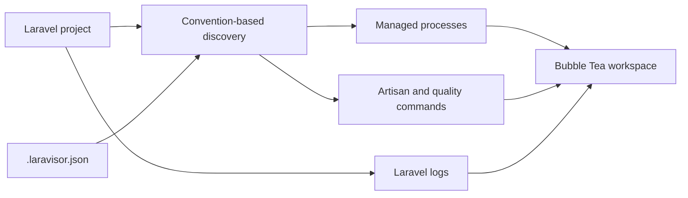

# Laravisor

**A keyboard-driven terminal workspace for Laravel development.**

[](https://github.com/MikeCVermeer/laravisor/actions/workflows/ci.yml)
[](https://github.com/MikeCVermeer/laravisor/releases/latest)
[](./LICENSE)
[](./go.mod)

[Case study](https://mikevermeer.dev/work/laravisor/) · [Latest release](https://github.com/MikeCVermeer/laravisor/releases/latest)

Laravisor discovers the processes, commands, quality tools, and logs around a Laravel project and brings them into one terminal UI. It reduces context switching without hiding the commands it runs or taking control away from the developer.

## Features

- Detects Laravel through `composer.json`.
- Discovers `artisan serve`, Vite, queues, Horizon, and Reverb when relevant.
- Starts, stops, restarts, and monitors long-running processes.
- Streams process output and Laravel logs inside the TUI.
- Browses and runs Artisan and `make:*` commands.
- Detects common testing and quality tools from Composer and `package.json`.
- Supports project-specific overrides and custom processes through `.laravisor.json`.
- Uses graceful `SIGTERM` shutdown before a bounded `SIGKILL` fallback.

## Install

### Release archive

Download the archive for your operating system and architecture from [GitHub Releases](https://github.com/MikeCVermeer/laravisor/releases/latest), extract it, and place `laravisor` somewhere on your `PATH`.

Published archives are available for macOS and Linux on both amd64 and arm64. Verify them against the accompanying `checksums.txt` file.

### Go

```bash
go install github.com/mikecvermeer/laravisor/cmd/laravisor@latest
```

## Quick start

Run Laravisor from the root of a Laravel project:

```bash
cd path/to/your-laravel-project
laravisor
```

Laravisor reads the project configuration, discovers available services and tools, watches Laravel logs when present, and opens the terminal workspace.

## Keyboard controls

| Key | Action |
|---|---|
| `Tab` / `Shift+Tab` | Move between tabs |
| `1`–`6` | Open Processes, Logs, Artisan, Make, Quality, or Config |
| `?` | Open About |
| `j` / `k` or arrow keys | Move through lists |
| `s` / `x` / `r` | Start, stop, or restart the selected process |
| `S` / `X` / `R` | Start, stop, or restart all processes |
| `/` | Search in supported views |
| `Enter` | Open output or run the selected command |
| `q` / `Ctrl+C` | Shut down managed processes and quit |

The footer inside each tab shows the controls available for the current view.

## Project configuration

Laravisor works without a configuration file. Add `.laravisor.json` to the Laravel project root when the defaults need adjustment:

```json
{
  "disabled": {
    "serve": false,
    "vite": false,
    "queue": true,
    "horizon": false,
    "reverb": false
  },
  "overrides": {
    "vite": {
      "command": "npm",
      "args": ["run", "dev"]
    }
  },
  "custom": [
    {
      "name": "scheduler",
      "display_name": "Scheduler",
      "command": "php",
      "args": ["artisan", "schedule:work"],
      "enabled": true
    }
  ],
  "quality": {
    "disabled_tools": []
  },
  "logs": {
    "max_lines": 2000,
    "files": []
  },
  "artisan": {
    "favorites": ["about", "route:list"]
  },
  "make": {
    "favorites": ["make:model", "make:migration"]
  }
}
```

## Runtime model



Laravisor runs commands locally with the same permissions as the current user. Managed processes receive `SIGTERM` first; if they do not exit within the timeout, Laravisor escalates to `SIGKILL`.

## Develop

Requirements: Go 1.25.6 or newer.

```bash
go mod download
go test ./...
go vet ./...
go build ./...
```

CI also verifies that `go.mod` and `go.sum` remain tidy and that the GoReleaser configuration is valid.

## Current limitations

- Laravisor must be started from a project with `laravel/framework` in `composer.json`.
- Discovery is convention-based; unusual setups may need `.laravisor.json` overrides.
- It manages local processes only and is not a container orchestrator or deployment tool.
- Commands run with the current user's privileges, so review project scripts before executing them.
- Terminal rendering depends on the capabilities of the active terminal emulator.
- Automatic restart policies are represented in the current configuration model but are not yet connected end to end to process-exit events.

## License

Laravisor is available under the [MIT License](./LICENSE).
